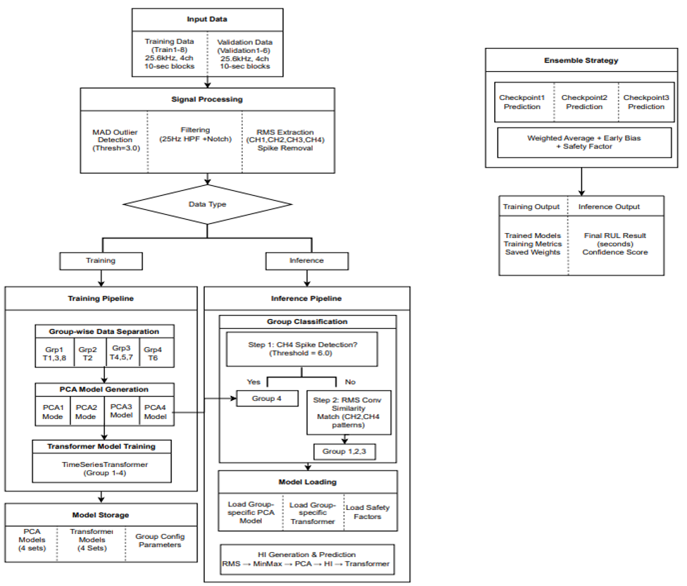
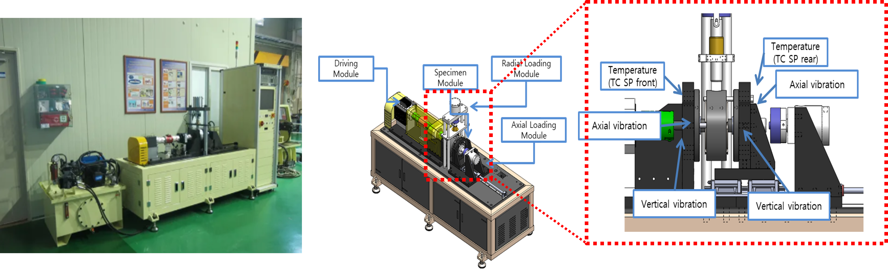

<p align="center">
  
</p>

<h1 align="center">Group-Specific Ensemble Transformer for Bearing RUL Prediction</h1>

<p align="center">
  <a href="https://www.python.org/"></a>
  <a href="https://pytorch.org/"></a>
  <a href="https://opensource.org/licenses/MIT"></a>
  <a href="https://phm-korea.or.kr/"></a>
</p>

<p align="center">
  <b>Precise Bearing Remaining Useful Life (RUL) Prediction Using Group-Specific Ensemble Transformers</b><br>
  그룹 특화 유사도 기반 앙상블 트랜스포머를 이용한 베어링 잔여수명(RUL) 정밀 예측
</p>

---

## Paper Information

> **Precise Bearing Remaining Useful Life (RUL) Prediction Using Group-Specific Ensemble Transformers**
>
> Juhun Lee, Yongkyung Ji
>
> *AI Mechatronics Laboratory (AML), Tech University of Korea*
>
> *KSPHM-KIMM Data Challenge, PHM Korea 2025*

**Advisor:** Prof. Hyoyoung Kim

**Laboratory Website:** [http://aml.tukorea.ac.kr/](http://aml.tukorea.ac.kr/)

---

## Overview

This repository contains the implementation of a **Group-Specific Ensemble Transformer** model for predicting the Remaining Useful Life (RUL) of bearings. The system addresses the challenge of bearing failure prediction by:

1. **Automatic Failure Pattern Clustering** - Data-driven grouping of diverse degradation patterns
2. **Group-Specific PCA-based Health Index** - Optimized Health Index generation for each group
3. **Ensemble Prediction with Safety Factors** - Reliable RUL prediction through ensemble methods

### Key Contributions

- **Novel Group Classification**: Convolution-based RMS pattern similarity matching for automatic bearing group classification
- **Adaptive Safety Factor**: Energy ratio-based safety factor calculation between validation and training data
- **Multi-Head Self-Attention**: 3-layer Transformer architecture capturing short-term, mid-term, and long-term degradation patterns
- **Asymmetric Scoring Optimization**: Model design considering early prediction penalties in the evaluation metric

---

## Testbed & Dataset

<p align="center">
  
</p>

### Data Acquisition System

| Parameter | Specification |
|-----------|---------------|
| **Sampling Rate** | Vibration: 25.6 kHz, Operation: 0.1 Hz |
| **Collection Cycle** | 10-second acquisition every 10 minutes |
| **Channels** | CH1-CH4 (Vibration), Torque, Temperature |
| **Data Format** | TDMS (National Instruments) |

### Dataset Structure

| Dataset | Sets | Description |
|---------|------|-------------|
| **Training** | Train1 ~ Train8 | 8 complete run-to-failure datasets |
| **Validation** | Validation1 ~ Validation6 | 6 partial degradation datasets |

### Training Data Characteristics

| Train ID | Lifetime (Hours) | Group | Failure Status |
|----------|------------------|-------|----------------|
| Train1 | 15.50 | Group 1 | Failed |
| Train2 | 24.67 | Group 2 | Normal |
| Train3 | 18.50 | Group 1 | Normal |
| Train4 | 36.83 | Group 3 | Failed |
| Train5 | 43.33 | Group 3 | Failed |
| Train6 | 8.00 | Group 4 | Anomaly |
| Train7 | 40.17 | Group 3 | Failed |
| Train8 | 16.50 | Group 1 | Failed |

### Data Access

#### Sample Data (Included)
This repository includes **sample data** for testing purposes:
- `data/sample/Train1/` - First 5 TDMS files from Train1 (~20MB)

#### Full Dataset
The complete dataset is provided by **KIMM (Korea Institute of Machinery and Materials)** for the PHM Korea 2025 Data Challenge.

**To obtain the full dataset:**
1. Visit [PHM Korea](https://phm-korea.or.kr/) official website
2. Contact KIMM for data access request
3. Place the downloaded data in the following structure:

```
data/
├── Train/
│   ├── Train1/
│   ├── Train2/
│   └── ... (Train8)
└── Validation Set/
    ├── Validation1/
    ├── Validation2/
    └── ... (Validation6)
```

> **Note:** The dataset is subject to KIMM's data usage policy. Please cite appropriately when using the data.

---

## System Architecture

### Overall Pipeline

```
┌─────────────────────────────────────────────────────────────────────────────┐
│                              INPUT DATA                                      │
│         Training Data (Train1-8) | Validation Data (Validation1-6)          │
│                    25.6kHz, 4ch, 10-sec blocks                               │
└─────────────────────────────────────┬───────────────────────────────────────┘
                                      │
                                      ▼
┌─────────────────────────────────────────────────────────────────────────────┐
│                           SIGNAL PROCESSING                                  │
│  ┌─────────────┐   ┌─────────────┐   ┌─────────────┐   ┌─────────────┐     │
│  │ MAD Outlier │ → │  25Hz HPF   │ → │ 50/60Hz     │ → │    RMS      │     │
│  │  Detection  │   │  Filtering  │   │ Notch Filter│   │ Extraction  │     │
│  └─────────────┘   └─────────────┘   └─────────────┘   └─────────────┘     │
└─────────────────────────────────────┬───────────────────────────────────────┘
                                      │
                    ┌─────────────────┴─────────────────┐
                    ▼                                   ▼
        ┌───────────────────┐               ┌───────────────────┐
        │  TRAINING PHASE   │               │ INFERENCE PHASE   │
        └─────────┬─────────┘               └─────────┬─────────┘
                  │                                   │
                  ▼                                   ▼
        ┌───────────────────┐               ┌───────────────────┐
        │ Group-wise Data   │               │ Group             │
        │ Separation        │               │ Classification    │
        │ ┌─────┬─────┬────┐│               │ (CH4 Spike +      │
        │ │Grp1 │Grp2 │Grp3││               │  RMS Similarity)  │
        │ │T1,3 │ T2  │T4,5││               └─────────┬─────────┘
        │ │ ,8  │     │ ,7 ││                         │
        │ └─────┴─────┴────┘│                         ▼
        └─────────┬─────────┘               ┌───────────────────┐
                  │                         │ Model Loading     │
                  ▼                         │ (Group-specific   │
        ┌───────────────────┐               │  PCA + Transformer│
        │ PCA Model         │               │  + Safety Factor) │
        │ Generation        │               └─────────┬─────────┘
        └─────────┬─────────┘                         │
                  │                                   ▼
                  ▼                         ┌───────────────────┐
        ┌───────────────────┐               │ HI Generation     │
        │ Transformer       │               │ & Prediction      │
        │ Model Training    │               │ RMS → MinMax →    │
        │ (TimeSeriesTF)    │               │ PCA → HI → TF     │
        └─────────┬─────────┘               └─────────┬─────────┘
                  │                                   │
                  ▼                                   ▼
        ┌───────────────────────────────────────────────────────┐
        │                   ENSEMBLE STRATEGY                    │
        │   ┌────────────┐ ┌────────────┐ ┌────────────┐        │
        │   │Checkpoint1 │ │Checkpoint2 │ │Checkpoint3 │        │
        │   │ Prediction │ │ Prediction │ │ Prediction │        │
        │   └─────┬──────┘ └─────┬──────┘ └─────┬──────┘        │
        │         └──────────────┼──────────────┘                │
        │                        ▼                               │
        │         ┌──────────────────────────┐                   │
        │         │ Weighted Average +       │                   │
        │         │ Early Bias + Safety      │                   │
        │         │ Factor                   │                   │
        │         └──────────────────────────┘                   │
        └───────────────────────┬───────────────────────────────┘
                                │
                                ▼
        ┌───────────────────────────────────────────────────────┐
        │                      OUTPUT                            │
        │     Training: Saved Models, Metrics, Weights           │
        │     Inference: Final RUL (seconds), Confidence Score   │
        └───────────────────────────────────────────────────────┘
```

---

## Methodology

### 1. Signal Processing Pipeline

Multi-stage noise removal and feature extraction for optimized RUL prediction:

| Stage | Method | Purpose |
|-------|--------|---------|
| **Stage 1** | MAD-based Outlier Detection (Threshold=3.0) | Remove anomalous data points |
| **Stage 2** | High-Pass Filter (25Hz cutoff) | Preserve bearing fault frequencies |
| **Stage 3** | Notch Filter (50/60Hz) | Remove power line interference |
| **Stage 4** | RMS Extraction (CH1-CH4) | Quantify vibration energy |
| **Stage 5** | Spike Removal | Ensure time-series continuity |

### 2. Group Classification

Convolution-based RMS pattern similarity matching:

```
Composite Score = Pattern Similarity (40%) + Scale Similarity (30%) + Absolute Difference (30%)
```

**Classification Flow:**
1. **Step 1:** CH4 Spike Detection (Threshold = 6.0) → Group 4 if detected
2. **Step 2:** RMS Convolution Similarity Match (CH2, CH4 patterns) → Group 1, 2, or 3

### 3. PCA-based Health Index

Three-step process for Health Index generation:

| Step | Description | Output |
|------|-------------|--------|
| **Step 1** | 4-Channel RMS Input & Preprocessing | Feature Matrix (N × 4) |
| **Step 2** | PCA Transformation (4D → 1D) | Raw Health Index |
| **Step 3** | Min-Max Normalization | HI ∈ [0, 1] |

### 4. TimeSeriesTransformer Model

```
Input: [HI_value, HI_change_rate]
       ↓
   Linear Embedding (2 → d_model)
       ↓
   Positional Encoding
       ↓
┌──────────────────────────────┐
│  Transformer Encoder Layer 1  │ ← Short-term patterns
├──────────────────────────────┤
│  Transformer Encoder Layer 2  │ ← Mid-term trends
├──────────────────────────────┤
│  Transformer Encoder Layer 3  │ ← Long-term dependencies
└──────────────────────────────┘
       ↓
   Linear Output Layer
       ↓
Output: Next HI Prediction
```

**Model Hyperparameters:**

| Parameter | Value |
|-----------|-------|
| d_model | 64 |
| n_head | 8 |
| num_layers | 3 |
| dim_feedforward | 128 |
| dropout | 0.1 |

### 5. RUL Conversion Formula

```
RUL = (1 - HI_predicted) × Group_Average_Lifetime × Safety_Factor
```

**Safety Factor Calculation:**
```
Safety_Factor = Validation_Segment_Energy / Training_Segment_Energy
```

---

## Project Structure

```
bearing-rul-prediction/
├── config/                          # Configuration Module
│   ├── __init__.py
│   ├── settings.py                  # Global settings (sampling rate, paths)
│   └── group_config.py              # Group-specific configurations
│
├── data_load/                       # Data Loading Module
│   ├── __init__.py
│   ├── loader.py                    # TDMS file loader
│   └── preprocessor.py              # Signal preprocessor
│
├── features/                        # Feature Extraction Module
│   ├── __init__.py
│   └── health_index.py              # PCA-based Health Index
│
├── models/                          # Deep Learning Models
│   ├── __init__.py
│   └── transformers.py              # Transformer architectures
│
├── prediction/                      # Prediction Module
│   ├── __init__.py
│   ├── ensemble.py                  # Ensemble prediction
│   ├── rul_predictor.py             # RUL predictor
│   └── integrated_system.py         # Integrated system
│
├── grouping/                        # Group Classification Module
│   ├── __init__.py
│   └── classifier.py                # Bearing group classifier
│
├── utils/                           # Utility Functions
│   ├── __init__.py
│   ├── signal_processing.py         # Signal processing functions
│   ├── display_utils.py             # Display utilities
│   └── model_utils.py               # Model utilities
│
├── saved_models/                    # Pre-trained Model Weights
│   ├── Valid13_transformer_ensemble_*.pt  (×3)
│   ├── Valid24_transformer_ensemble_*.pt  (×3)
│   └── Valid56_model_ensemble_*.pt        (×3)
│
├── data/                            # Dataset Directory
│   ├── Train/                       # Training data (Train1-8)
│   └── Validation Set/              # Validation data (Validation1-6)
│
├── assets/                          # Documentation Assets
│   ├── testbed.png                  # Testbed image
│   └── overallarchitecture.png      # Architecture diagram
│
├── main.py                          # Main execution file
├── train_save_model.py              # Model training script
├── requirements.txt                 # Python dependencies
└── README.md                        # This file
```

---

## Installation

### Prerequisites

- Python 3.8+
- CUDA 11.x (optional, for GPU acceleration)

### 1. Clone the Repository

```bash
git clone https://github.com/juhun7777/bearing-rul-prediction.git
cd bearing-rul-prediction
```

### 2. Install Dependencies

```bash
pip install -r requirements.txt
```

### 3. GPU Support (Optional)

For CUDA 11.8:
```bash
pip install torch torchvision --index-url https://download.pytorch.org/whl/cu118
```

For CPU only:
```bash
pip install torch torchvision --index-url https://download.pytorch.org/whl/cpu
```

---

## Usage

### Quick Start

```bash
python main.py
```

### Individual Module Testing

```python
# Test group classification only
from grouping.classifier import BearingGroupClassifier
classifier = BearingGroupClassifier()
results = classifier.classify_all_validations(verbose=True)

# Test single validation prediction
from prediction.rul_predictor import GroupBasedRULPredictor
predictor = GroupBasedRULPredictor()
result = predictor.predict_single_validation("Validation1", group_id=1)
```

### Training New Models

```bash
python train_save_model.py
```

---

## Scoring Function

The evaluation metric penalizes late predictions more heavily than early predictions:

$$A_{RUL} = \begin{cases} \exp\left(-\ln(0.5) \times \frac{E_r}{E_0}\right) & \text{if } E_r < 0 \text{ (Early)} \\ \exp\left(+\ln(0.5) \times \frac{E_r}{E_0}\right) & \text{if } E_r > 0 \text{ (Late)} \end{cases}$$

where $E_r = \frac{\text{Actual RUL} - \text{Predicted RUL}}{\text{Actual RUL}} \times 100$

| Percent Error (%) | Score | Type |
|-------------------|-------|------|
| -40 | 0.2500 | Conservative |
| -20 | 0.5000 | Conservative |
| 0 | 1.0000 | Perfect |
| +20 | 0.7579 | Optimistic |
| +40 | 0.5743 | Optimistic |

---

## Requirements

```
numpy>=1.21.0          # Numerical computation
pandas>=1.3.0          # Data manipulation
scipy>=1.7.0           # Signal processing
scikit-learn>=1.0.0    # PCA, MinMaxScaler
torch>=1.9.0           # Deep learning
nptdms>=1.4.0          # TDMS file reading
tqdm>=4.62.0           # Progress bars
openpyxl>=3.0.0        # Excel file generation
matplotlib>=3.5.0      # Visualization
seaborn>=0.11.0        # Advanced visualization
```

---

## Citation

If you use this code in your research, please cite:

```bibtex
@inproceedings{lee2025bearing,
  title={Precise Bearing Remaining Useful Life Prediction Using Group-Specific Ensemble Transformers},
  author={Lee, Juhun and Ji, Yongkyung},
  booktitle={PHM Korea 2025 - KSPHM-KIMM Data Challenge},
  year={2025},
  organization={Korean Society for Prognostics and Health Management}
}
```

---

## License

This project is licensed under the MIT License - see the [LICENSE](LICENSE) file for details.

---

## Contact

- **Juhun Lee** - AI Mechatronics Laboratory, Tech University of Korea
- **Email:** juhun7777@tukorea.ac.kr
- **Laboratory:** [http://aml.tukorea.ac.kr/](http://aml.tukorea.ac.kr/)

---

## Acknowledgments

- Korea Institute of Machinery and Materials (KIMM) for providing the bearing test data
- Korean Society for Prognostics and Health Management (KSPHM) for organizing the data challenge
- Prof. Hyoyoung Kim for guidance and supervision

---

<p align="center">
  <i>Developed with dedication at AI Mechatronics Laboratory, Tech University of Korea</i>
</p>
